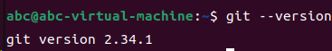
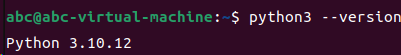
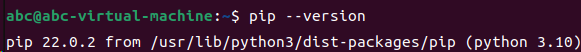
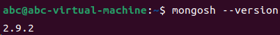
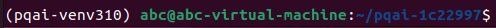
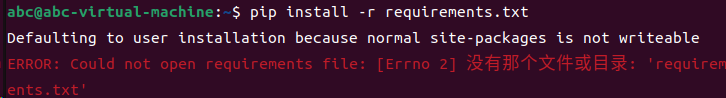
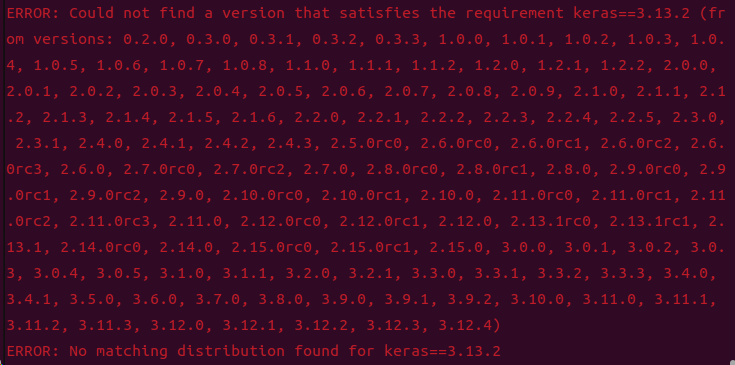

# 安装指南（Installation Guide）  

> 本文档基于PQAI官方的[PQAI本地部署说明](https://github.com/pqaidevteam/pqai/wiki/Deployment)编写，并根据实操记录补充了常见问题。

## 在Ubuntu上本地部署PQAI  

> 硬件要求：  
> - 内存：≥ 8 GB
> - 可用磁盘空间：≥ 40 GB
---
### Step0. 环境配置  

#### 1. 安装并运行git  

- 若你的系统已安装了git，可以在终端运行以下命令进行验证：  
`git --version`  
若运行上述命令后返回git版本号，说明git已安装，示例：  


- 若你的系统未安装git或上述命令出现错误，可以在终端运行以下命令来安装git，或者通过git的[官方安装网址](https://git-scm.com/book/zh/v2/%E8%B5%B7%E6%AD%A5-%E5%AE%89%E8%A3%85-Git)进行安装。  
` sudo apt install git`

#### 2. 安装并运行Python3(推荐 Python 3.10)  

- 若你的系统已安装了Python3，可以在终端运行以下命令进行验证：  
`python3 --version`  

  ***提示**：若上述命令运行错误，可以尝试将上述命令中的`python3`替换为`python`，若替换有效则后续所有命令均需应用该替换。*  

  若运行上述命令后返回Python3版本号，说明Python3已安装，示例：


- 若你的系统未安装Python3或上述命令出现错误，可以在终端运行以下命令，或者通过Python的[官方安装网址](https://www.python.org/downloads/)进行安装。  
`sudo apt install python3`

#### 3. 安装并运行pip

- 若你的系统已安装了pip，可以在终端运行以下命令进行验证：  
`pip --version`  
若运行上述命令后返回pip版本号，说明pip已安装，示例：  
  

- 若你的系统未安装pip，可以在终端运行以下命令进行安装：  
`sudo apt install python3-pip`

#### 4. 安装并运行Mongo DB

- 若你的系统已经安装了Mongo DB，可以在终端运行以下命令进行验证：  
`mongosh --version`  
若运行上述命令后返回Mongo DB的版本号，说明Mongo DB已安装，示例：  


- 若你的系统未安装Mongo DB，可以通过Mongo DB的[官方文档](https://www.mongodb.com/zh-cn/docs/manual/administration/install-community/?linux-distribution=ubuntu&linux-package=default&operating-system=linux&search-linux=with-search-linux)进行安装。

#### 5.安装项目依赖  

- 在终端运行以下命令安装PQAI所需的项目依赖:  
`sudo apt-get update && sudo apt-get install unzip gcc g++ libgl1-mesa-glx libglib2.0-0 libsm6 libxrender1 libxext6 -y`

### 现在你已经准备好开始在你的系统上安装PQAI了。  

### Step1. 获取代码  

>***说明***：经验证，官方master 分支当前的 `requirements.txt` 存在版本兼容问题，在后续的Python包安装环节会出现`No matching distribution found for keras==3.13.2`、`ERROR: No matching distribution found for tensorflow==2.9.3
`等报错。  
本安装指南使用经验证的历史提交`1c22997`，该版本可与Ubuntu 22.04 自带的 Python 3.10.12相适配。  

- **方式一**：git 克隆并切换到指定提交。在终端输入以下命令：  
  ```bash
  cd ~
  git clone https://github.com/pqaidevteam/pqai.git
  cd pqai
  git checkout 1c22997
  ```    
   *通过此方式下载的源码目录为 `~/pqai`*  

- **方式二**：git克隆因网络问题下载中断时，下载指定提交zip 并解压至`pqai-1c22997`。在终端输入以下命令：  
  ```bash
  cd ~
  wget -O pqai-1c22997.zip "https://github.com/pqaidevteam/pqai/archive/1c22997.zip"
  unzip pqai-1c22997.zip
  mv pqai-1c22997ff07d7b2f0d6078165e05cbb7ebad6beb pqai-1c22997
  cd pqai-1c22997
  ```
  *通过此方式下载的源码目录为 `~/pqai-1c22997`*  

### Step2. 创建Python3虚拟环境并安装Python依赖  

#### 1. 创建用于PQAI的Python3虚拟环境  
- 若你的系统未安装venv 组件，可以在终端运行以下命令进行安装：  
  `sudo apt install -y python3.10-venv`
- 在终端运行以下命令创建用于PQAI的虚拟环境：  
  ```
  cd ~
  python3 -m venv pqai-venv310
  ```
- 在终端运行以下命令激活虚拟环境（每次新开终端都要重新激活）：  
`source pqai-venv310/bin/activate`

#### 2. 获取PQAI所需的Python依赖
>***注意***：此操作前提需确保终端处于 PQAI 源码目录，且虚拟环境已激活（终端提示符开头有 `(pqai-venv310)`）。示例：  


- 方式一：在终端输入以下命令来下载PQAI所需的Python依赖：  
`python -m pip install -r requirements.txt`  
- 方式二（推荐）：若方式一因网络问题中断，在终端运行以下命令从国内镜像源（如清华源）下载PQAI所需Python依赖：  
  ```
  python -m pip install -r requirements.txt -i https://pypi.tuna.tsinghua.edu.cn/simple --timeout 120 --retries 5
  ```  

### Step3. 获取PQAI所需的其他依赖
- 在终端输入以下命令来下载PQAI所需的其他依赖文件并将其解压到源码目录下的`models/`文件夹：  
  ```
  curl -o pqai-assets-latest.zip "https://s3.amazonaws.com/pqai.s3/public/pqai-assets-latest.zip"
  unzip pqai-assets-latest.zip -d models/
  ```  

### Step4. 建立专利数据库
>***注意***：此操作前提需确保终端处于 PQAI 源码目录，且MongoDB 已启动。
- 在终端运行以下命令下载专利数据库备份并将其解压，然后导入至MongoDB：  
  ```
  curl -o mongodump.tar.gz "https://s3.amazonaws.com/pqai.s3/public/pqai-mongo-dump.tar.gz"
  tar -x --use-compress-program=pigz -f mongodump.tar.gz
  mongorestore
  ```
- 若运行上述命令后返回`pigz: command not found`，可以先在终端运行命令`sudo apt install -y pigz`，再重新执行上述命令。  

### Step5. 获取索引
- 在终端运行以下命令下载样本索引并解压至`indexes/`文件夹：  
  ```
  curl -o index.zip "https://s3.amazonaws.com/pqai.s3/public/sample-index.zip"
  unzip index.zip -d indexes/
  ```
- 在终端运行以下命令验证样本索引：  
  `ls indexes/`
  若运行上述命令后返回索引文件，说明索引已存在。

>提示： 如需使用自定义专利数据重建索引,你可以参考源码目录下的`scripts/mongo2faiss.py`。

### Step6. 配置运行环境并运行PQAI
1. 在终端位于源码目录的前提下，在终端运行以下命令创建模板文件的副本并将其命名为`.env`：  
  `cp env .env`  
  *提示*：`.env`为以点开头的隐藏文件。  

2. 在终端运行命令`nano .env`打开`.env`文件，为环境变量填写合适的值。  
   确认以下变量`API_PORT=8501`、`MONGO_DBNAME="pqai"` 、`DISABLE_GPU=1`，其余变量保持默认即可。

3. 在终端运行以下命令启动PQAI的Web服务：  
  `python server.py`  

4. 启动后，浏览器打开地址`http://localhost:8501` 进入PQAI界面。

### Step7. 清理不再需要的下载压缩包（可选）
- 在终端运行以下命令清理不再需要的下载压缩包：
  ```
  rm pqai-assets-latest.zip
  rm index.zip
  rm mongodump.tar.gz
  ```  

***注意***：仅以上压缩包可删除，其余文件数据为运行必需的，请不要删除。  

---
##  常见问题及解决方式

### 1. Step2中运行获取Python依赖命令后，返回报错“没有那个文件或目录”
- 报错示例：


- 问题原因：  
终端当前所处目录并非`requirements.txt`所在的源码目录，因此直接运行命令无法找到`requirements.txt`。  

- 解决方式：（以`requirements.txt`所在的源码目录为`~/pqai-1c22997`为例）  
方式一：先在终端中运行命令`cd ~/pqai-1c22997`来使终端进入源码目录，之后在终端中运行命令`python -m pip install -r requirements.txt`;  
方式二：直接在Step2的命令中插入源码目录地址，也即在终端运行命令`python -m pip install -r ~/pqai-1c22997/requirements.txt`。

### 2. Step2中Python依赖下载超时  
- 问题原因：  
pip 从 PyPI 官方源下载依赖时网络超时。  

- 解决方式：  
可以尝试换国内镜像源重新下载，或者适当调大超时时间。可选的国内镜像源下载命令如下：  
1. 清华源（推荐）：  
    ```
    python -m pip install -r requirements.txt -i https://pypi.tuna.tsinghua.edu.cn/simple --timeout 120 --retries 5
    ```  
2. 阿里云源：  
    ```
    python -m pip install -r requirements.txt -i https://mirrors.aliyun.com/pypi/simple/ --timeout 120 --retries 5
    ```  

### 3. Step2中Python依赖下载报错`No matching distribution found for keras==3.13.2`、或者报错`ERROR: No matching distribution found for tensorflow==2.9.3`  
- 报错示例：

- 问题原因：  
  官方最新master 分支的 `requirements.txt` 中， `tensorflow==2.9.3` 与 `keras==3.13.2` 对 Python 版本的要求相互冲突，在任何 Python 版本下都无法同时满足。此问题与下载源或系统Python配置无关。
  
- 解决方式：  
  参考本安装指南的Step1，使用经验证的历史提交`1c22997`重新获取源码。  
 
### 4. Step3中依赖文件下载中断
- 问题原因：  
  通常是网络问题导致。
- 解决方式：  
  在终端运行以下命令从中断处继续下载：  
  ```
  cd ~/pqai-1c22997
  curl -C - -L -o pqai-assets-latest.zip "https://s3.amazonaws.com/pqai.s3/public/pqai-assets-latest.zip"
  ```

---
## 7. 参考
- [PQAI Wiki](https://github.com/pqaidevteam/pqai/wiki)